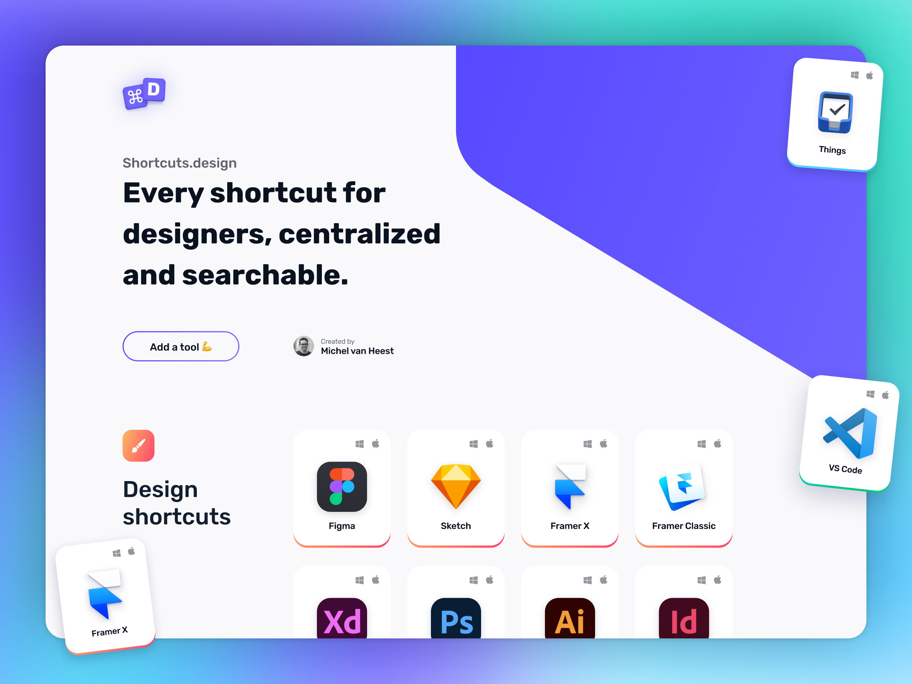

<h1 align="center">
  Shortcuts.design — Every shortcuts for designers, centralized and searchable.<br>
  <p align="center">
	  <a href="https://stats.uptimerobot.com/kXWkYTnGQn">
	    
	    <a href="https://app.netlify.com/sites/agitated-poincare-681d60/deploys">
	    
	  </a>
	  <a href="https://twitter.com/michelvanheest">
	    
	  </a>
  </p>
</h1>




## Introduction
Hi, I'm [Michel](https://www.michelvanheest.com), the creator of [Shortcuts.design](https://shortcuts.design). Shortcuts.design lists every shortcut for designers in one place and in a simple and clear way. It's a centralized and searchable online database that helps over 12k designers every month to charge their workflow.

## Contributing
Please use [GitHub issues](https://github.com/michelvanheest/shortcuts-design-data/issues/new) to report any bugs or feature requests. If you can, please fix it yourself and send in a PR.

**Note:** all data is in plain HTML, I'm working on that 😅

### Running the project
- Install: `npm install`
- Build: `npx @11ty/eleventy`
- Run: `npx @11ty/eleventy --serve`

### Changing data
Edit the data of a specific tool in `data/{category}/toolpages-{toolname}.html`.

### Adding tools
1. Add a new file to `/tools`, for example `toolspage-adobephotoshop.md` with the following data:

	```
	---
	layout: layouts/tool.njk
	tool: {tool-name-here}
	os1: Mac (🚨note: leave empty if you only add one OS)
	os2: Windows (🚨note: leave empty if you only add one OS)
	toolSlug: {toolnamewithoutdashes}
	toolGroup: (pick from *Design*, *Development*, *Productivity* or *3D*)
	toolDescription: {write a description about the tool here}
	toolLink: {link to the tool here}
	toolLinkDescription: {how the link should be displayed}
	---
	```
2. Add a logo to `assets/img` with the following naming-convention: `logo-{toolslug}.png`, logo's should be 264*264px and don't have a shadow.
3. Add the data to `data/{category}/`. Use the formating instructions below. For quick generation of the needed HTML, use one of the following files:
	- <a href="https://github.com/michelvanheest/shortcuts-design-data/blob/master/docs/Shortcuts.design-data-creator.xlsx">MS Excel</a>
	- <a href="https://github.com/michelvanheest/shortcuts-design-data/blob/master/docs/Shortcuts.design-data-creator.numbers">Apple Numbers</a>

### Symbols

Please keep the code/data clean and consistent by using the following symbols when adding shortcuts on Mac tools-pages:

| Key | Symbol |
|---|---|
| Control | ⌃ |
| Option / Alt | ⌥ |
| Command | ⌘ |
| Shift | ⇧ |
| Enter | ↩ |
| Arrow keys | ↑ ↓ ← → |


## Links
- [Shortcuts.design website](http://shortcuts.design/)
- [Personal website - Michel van Heest](https://www.michelvanheest.com)
- [Twitter - Michel van Heest](https://twitter.com/michelvanheest)
